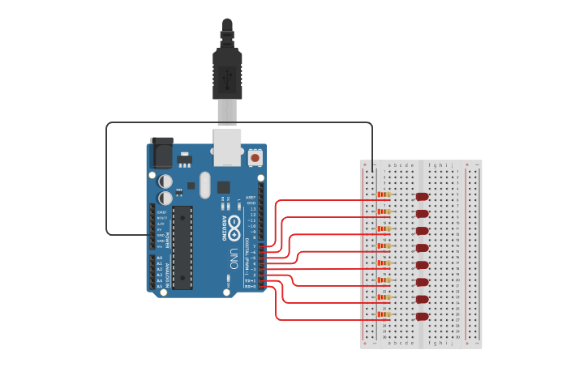

# Hello World in Arduino UNO R3

my first project in Arduino Uno R3

# Components

* 1 Arduino Uno R3
* 8 Resistors 220Ω
* 8 LEDs

# Circuit

8 LEDs connected to Arduino pins from 0 to 7. Once it started it will turn on one led at a time in increasing sequence
and then in a decreasing sequence.

# Code

The code for Arduino can be found in the `src` directory. It's just a single file written in `C`.

# Simulation

[watch how it works in tinkercad](https://www.tinkercad.com/things/0lzlp52z709)

